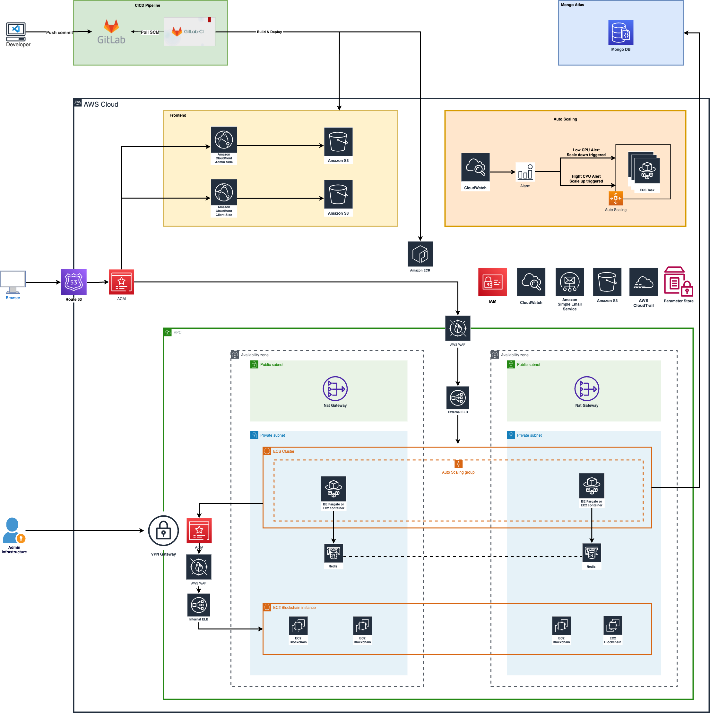

# rbo-infra

【RBO】インフラ




### Development

#### Init for first time
1. Init Route53 Hosted ZoneID
   1. Following the document [here]("https://docs.aws.amazon.com/Route53/latest/DeveloperGuide/CreatingHostedZone.html")
2. Create VPN Certificates
   1. Clone the OpenVPN easy-rsa repo to your local computer and navigate to the easy-rsa/easyrsa3 folder.
      ```shell
      git clone https://github.com/OpenVPN/easy-rsa.git

      cd easy-rsa/easyrsa3
      ```
   2. Initialize a new PKI environment.
      ```shell
      ./easyrsa init-pki
      ```
   3. To build a new certificate authority (CA), run this command and follow the prompts.
      ```shell
      ./easyrsa build-ca nopass
      ```
   4. Generate the server certificate and key.
      ```shell
      ./easyrsa build-server-full server nopass
      ```
   5. Generate the client certificate and key.

      Make sure to save the client certificate and the client private key because you will need them when you configure the client.
      ```shell
      ./easyrsa build-client-full client1.domain.tld nopass
      ```

      You can optionally repeat this step for each client (end user) that requires a client certificate and key.
   6. Copy the server certificate and key and the client certificate and key to a custom folder and then navigate into the custom folder.

      Before you copy the certificates and keys, create the custom folder by using the mkdir command. The following example creates a custom folder in your home directory.
      ```shell
      mkdir ~/custom_folder/

      cp pki/ca.crt ~/custom_folder/

      cp pki/issued/server.crt ~/custom_folder/

      cp pki/private/server.key ~/custom_folder/

      cp pki/issued/client1.domain.tld.crt ~/custom_folder

      cp pki/private/client1.domain.tld.key ~/custom_folder/

      cd ~/custom_folder/
      ```
   7. Upload the server certificate and key and the client certificate and key to ACM. Be sure to upload them in the same Region in which you intend to create the Client VPN endpoint. The following commands use the AWS CLI to upload the certificates. To upload the certificates using the ACM console instead, see [Import a certificate]("https://docs.aws.amazon.com/acm/latest/userguide/import-certificate-api-cli.html") in the AWS Certificate Manager User Guide.
      ```shell
      aws acm import-certificate --certificate fileb://server.crt --private-key fileb://server.key --certificate-chain fileb://ca.crt

      aws acm import-certificate --certificate fileb://client1.domain.tld.crt --private-key fileb://client1.domain.tld.key --certificate-chain fileb://ca.crt
      ```

#### Init resource for first time
1. Create s3 bucket
   - `rbo-check-ag-local-development-tfstate`
   - `terraform-backend-backend.tfstate`
2. Create common resource
    ```shell
    cd tf/initial/development

    terraform init

    terraform plan

    terraform apply

    ```

#### Create Service (Architecture)

1. For Frontend
    ```shell
    cd tf/application/frontend

    terraform init

    terraform plan

    terraform apply
    ```
2. For Backend

    ```shell
    cd tf/application/backend

    terraform init

    terraform plan

    terraform apply
    ```

#### Destroy Service (Architecture)

- Go to config service directory

- Run Shell

  ```shell
  terraform destroy
  ```
